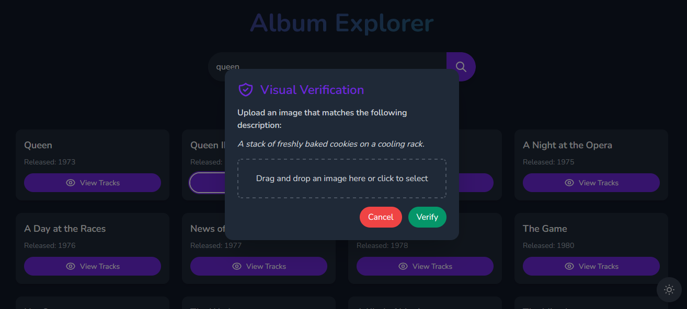

# Reverse Captcha

## Live Demo

Try the live version [here](https://reversecaptcha.onrender.com/).

## Overview

Reverse Captcha is a web app that replaces traditional CAPTCHAs with a unique challenge: match a text description with an image. It features a Go backend and a frontend built with HTML, Tailwind CSS, and JavaScript.



## Features

- Search and view artist albums
- Reverse CAPTCHA to access track lists

## How It Works

1. Enter an artist name to get album lists.
2. Select an album and complete a Reverse CAPTCHA to view the track list.
3. Match the text description with an image to pass the CAPTCHA.

## Tech Stack

- **Backend:** Go
- **Frontend:** HTML, Tailwind CSS, JavaScript

## Installation

### Prerequisites

- Go
- OpenAI API Key (for CAPTCHA)

### Setup

1. Clone the repo:
    ```bash
    git clone https://github.com/danielshemesh/reversecaptcha
    cd reversecaptcha
    ```

2. Navigate to the backend directory:
    ```bash
    cd backend
    ```

3. Set environment variables:

   **Linux/MacOS:**
    ```bash
    export OPENAI_API_KEY=your_openai_api_key
    export OPENAI_API_BASE_URL=https://api.openai.com/v1
    ```

   **Windows (Command Prompt):**
    ```cmd
    set OPENAI_API_KEY=your_openai_api_key
    set OPENAI_API_BASE_URL=https://api.openai.com/v1
    ```

   **Windows (PowerShell):**
    ```powershell
    $env:OPENAI_API_KEY="your_openai_api_key"
    $env:OPENAI_API_BASE_URL="https://api.openai.com/v1"
    ```

4. Install Go dependencies:
    ```bash
    go mod tidy
    ```

5. Run the server:
    ```bash
    go run backend.go
    ```

   Access the app at `http://localhost:8080`.
